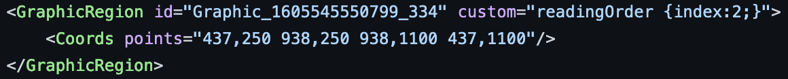
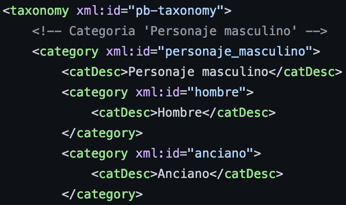
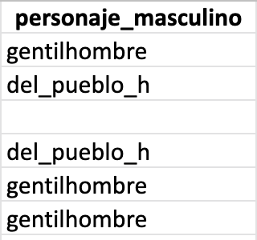
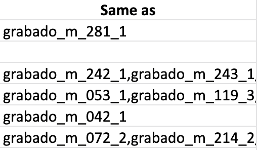

# engravings-catalogue

This repository contains the description of each engraving of the [Moreno corpus](https://github.com/DesenrollandoElCordel/Moreno-TEI-files).

## Workflow
### 1. Extraction of the engravings
The [XML-Page files](https://github.com/DesenrollandoElCordel/Moreno-OCR-files) produced by the OCR tool Transkribus not only give us the coordinates of each line of text, but also the coordinates of the illustrations. These coordinates are encoded with a \<GraphicRegion\> markup.

Each illustration has been extracted with the Python script [extraction_gravures.py](https://github.com/DesenrollandoElCordel/code-python/blob/main/extraction_gravures.py). This script gets the coordinates of each illustration and transforms them into a rectangular zone (x/y + width/height) to ease the extraction and to overcome an issue with the order of the coordinates in the XML Page files.
These new coordinates are recorded in ...

### 2. Description of the illustrations
#### 2.1. General description
The illustrations were first described in an Excel file (...). We indicate the identifier of the *pliego* and the number of the page from which the illustration was extracted ; its coordinates on this page ; the title of the pliego, as well as its date, publisher and place of publication ; several keywords spread in different categories ; the list of similar illustrations in the corpus ; and finally some technical information about the status of the data (extracted, encoded, etc.).
#### 2.2. Keywords categories
Specific categories and keywords has been created to fit the particularities of *pliegos*' illustrations.
These categories are described in an XML TEI file ([taxonomy_grabados.xml](taxonomy_grabados.xml)), which follows the [model](https://teipublisher.com/exist/apps/tei-publisher/doc/documentation.xml?odd=docbook.odd&id=facets) recommended by the application [TEI-Publisher](http://teipublisher.com/exist/apps/tei-publisher-home/index.html) that we are using for the publication Web of our project.

The xml:id of these categories and keywords are then used in the Excel file to describe each illustration.

#### 2.3. Detection of similarity
To detect similar illustrations in the Moreno Corpus, we used the [VGG Image Search Engine (VISE)](https://www.robots.ox.ac.uk/~vgg/software/vise/index.html), developed by the Department of Engineering Science of the Oxford University.
The results obtained with this tool have been write down in the Excel file.

### 3. Encoding